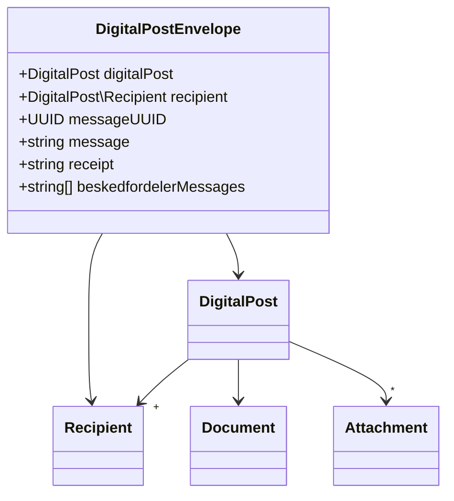

# NgDP

We use [SF1601](https://digitaliseringskataloget.dk/integration/sf1601) for
sending digital post.

When a digital post is sent an envelope (`DigitalPostEnvelope`) is created for
each recipient and the envelope is queued for sending to the recipient via
SF1601.

Use the `tvist1:digital-post-envelope:list` command to list all digital post
envelopes:

```sh
docker compose exec phpfpm bin/console tvist1:digital-post-envelope:list
```

## Digital post queue

Process the digital post send queue with

```sh
docker compose exec phpfpm bin/console messenger:consume async -vv
```

See [Deploying to
Production](https://symfony.com/doc/5.4/messenger.html#deploying-to-production)
for details on how to process the queue in production. If using `cron`, you want
to use something along the lines of `--limit=10 --time-limit=240` to not let the
worker run forever.

The final `cron` spell may look like

```sh
*/5 * * * * docker compose exec phpfpm bin/console messenger:consume async -vv --limit=10 --time-limit=240 > /dev/null 2>&1
```

`--time-limit` should depend on `*/5`, i.e. when running the cron task every 5
minutes, the time limit should be a little less than 300 (5 × 60) seconds.

### Failed queue messages

Failed messages are added to a “failed” transport. See [Saving & Retrying Failed
Messages](https://symfony.com/doc/5.4/messenger.html#saving-retrying-failed-messages)
for details on how to handle these.

## Beskedfordeler

Digital post is sent synchronously when processing the queue, but information on
if and how the digital post is actually delivered to a recipient is provided
asynchronously by [Fælleskommunal
Beskedfordeler](https://digitaliseringskataloget.dk/l%C3%B8sninger/beskedfordeler).
See [SF1601 Postkomponent - Beskedfordeler -
PKO_PostStatus.pdf](https://digitaliseringskataloget.srvitkhulk.itkdev.dk/digitaliseringskataloget.dk/sf1601/SF1601%20Bilag%2020211025/SF1601%20Postkomponent%20-%20Beskedfordeler%20-%20PKO_PostStatus.pdf)
for details on the `PKO_PostStatus` message.

Beskedfordeler must be configured to send messages to the
`/beskedfordeler/postStatusBeskedModtag` endpoint (see
<https://digitaliseringskataloget.dk/kom-godt-i-gang-vejledninger> » “Kom godt i
gang med” » “Fælleskommunal Beskedfordeler”
(<https://docs.kombit.dk/latest/ba48e791>) for details on how to do this).

### Development

For security reasons (?) Beskedfordeler can only send messages to https
endpoints secured with whitelisted SSL certificates (see
[Besked-FåTilsendt-Snitflade](https://digitaliseringskataloget.srvitkhulk.itkdev.dk/digitaliseringskataloget.dk/sf1461/D.09.02%20Beskedfordeler-Besked-F%C3%A5Tilsendt-Snitflade.pdf)
» 6. Teknisk beskrivelse).

During delopment and test you can forward the messages to a test endpoint using
[Beskedfordeler forward](https://github.com/itk-dev/beskedfordeler-forward). For
local development you can use tools like
[localtunnel](https://github.com/localtunnel/localtunnel) or
[ngrok](https://ngrok.com/) to forward to your local machine.

Use

```sh
npx localtunnel --port "$(docker compose port nginx 8080 | cut -d: -f2)" --subdomain "$USER-naevnssekretariatet" --print-requests
```

to expose your local docker compose setup and forward Beskedfordeler messages to
the url reported by

```sh
echo "https://$USER-naevnssekretariatet.loca.lt/beskedfordeler/PostStatusBeskedModtag"
```

#### Testing

The `tvist1:digital-post-envelope:send` command can be used to send digital post:

```sh
docker compose exec phpfpm bin/console tvist1:digital-post-envelope:send --help
```

#### Testing error in MeMo message

Apply a patch that to send invalid MeMo message (without a header label):

```sh
git apply tests/patches/sf1601/malformed-memo-message.patch
```

```sh
docker compose exec phpfpm bin/console hautelook:fixtures:load --no-bundles --purge-with-truncate --no-interaction
docker compose exec phpfpm bin/console tvist1:digital-post-envelope:send --digital-post-subject='Digital post with multiple recipients' --no-interaction
```

Remove the patch:

```sh
git apply --reverse tests/patches/sf1601/malformed-memo-message.patch
```

List the envelopes:

```sh
docker compose exec phpfpm bin/console tvist1:digital-post-envelope:list --status=failed
```

#### Testing invalid responses

```sh
git apply tests/patches/sf1601/invalid-service-urls.patch
```

## Class diagram


